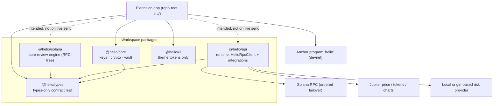
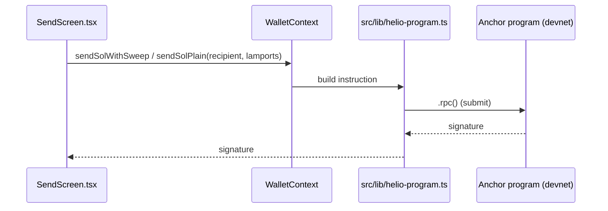

# Architecture

> **Status:** Accurate as of extension `v0.1.5` (manifest), source synced 2026-05. This document describes the **Chrome extension only**. It is kept honest — where the live code diverges from the intended design, that gap is called out explicitly (see [Current reality vs intended design](#current-reality-vs-intended-design)).
>
> 📱 Mobile app: developed as a separate repo — see `/mobile`.

Helio Wallet is a non-custodial Solana Chrome extension (Manifest V3, MIT-licensed). The vision: _"the Solana wallet that thinks before it sends, and earns while you sleep"_ — built around two headline differentiators, **Smart Transaction Adjustment** and **AutoYield**. This document maps the codebase that backs that vision today, and is candid about which pieces are shipping versus scaffolded.

---

## Where the live code lives

The live extension source is at **repo-root `src/`**, not `apps/extension/`.

```
index.html → src/main.tsx → src/App.tsx
```

- **`src/`** (repo root) — the **shipping** extension: React 19 UI, contexts, screens, and the in-page Solana logic. This is what builds and runs.
- **`apps/extension/`** — holds only a **stale `dist` build**. Deprecated; ignore it. Do not edit it.
- **`apps/mobile/`** — empty (node_modules only); the mobile app is moving to a separate repo (`/mobile`).

The same `src/` build is shipped two ways: as the **Chrome extension package** (MV3) and as a **Vercel SPA** (hash routing, immutable asset cache).

---

## Tech stack (verified)

| Layer | Choice |
|---|---|
| Monorepo | **pnpm@9 workspaces + Turborepo** |
| UI | **React 19.2 + TypeScript** (strict mode `true` in `tsconfig.base.json`) |
| State | **React Context + hooks** (Zustand is **not** installed/used) |
| Routing | Hand-rolled **`RouterContext`** with **hash-based** routing (so reloads don't 404). `wouter` is installed but unused (should be removed) |
| Styling | **Tailwind CSS v3** + `tailwindcss-animate` + `tailwind-merge`, PostCSS |
| Build | **Vite 7.x** (not CRXJS). MV3 packaged via static `public/manifest.json` + manual Rollup inputs |
| Solana SDK | **@solana/web3.js ^1.98.4** (v1 — a v2 migration is Planned) + **@solana/spl-token ^0.4.14** |
| HTTP | **ky ^2.x** · Icons: **lucide-react** |
| Lint/format | **Biome 2.x** (single tool) |
| Testing | **Vitest 3.2.4** — unit only. No Playwright, no E2E yet |
| CI | **None** — there is no `.github/workflows`. CI is a Planned/target item |
| Cluster | Runs on **devnet** by default _(a known UI bug mislabels it "Mainnet" — a code fix, not a doc claim)_ |

The MV3 bundle is built from four Rollup inputs declared in `vite.config.ts`:

- `popup` → `index.html`
- `background` → `src/extension-runtime/background.ts`
- `content-script` → `src/provider-bridge/provider-content-script.ts`
- `injected-provider` → `src/provider-bridge/provider-injected.ts`

---

## Package boundaries

The workspace splits into five packages plus the app at `src/`. See ADR-0001 (`docs/adr/0001-package-boundaries.md`).



> **Note:** The RPC client (`HelioRpcClient`) lives in **`@helio/api`**, _not_ `@helio/solana`. Earlier diagrams that drew `@helio/solana → RPC` were wrong. `@helio/solana` is deliberately **RPC-free**.

### `@helio/core` — keys & crypto

Key management and security-sensitive primitives:

- BIP39 mnemonics; hand-rolled **SLIP-0010 ed25519 HD derivation** (path `m/44'/501'/0'/0'`, Phantom-compatible).
- **AES-256-GCM + PBKDF2-SHA256** encrypted vault (`wallet-vault.ts`, ~310k iterations).
- Message signing, password policy, best-effort byte zeroing.
- Note: `ed25519-hd-key` is a **declared-but-unused** dependency.

### `@helio/solana` — pure review engine (RPC-free)

No network access. Holds:

- The **smart-transaction review engine** + priority-fee estimator.
- The **AutoYield state machine**.
- **Known issue:** `auto-yield-program.ts` derives PDAs from the SPL **token-swap example** program id (`Fg6Pa…Q7QZ`), **not** Helio's real deployed program (`Bc5g2…`). It is local simulation only and must be fixed.

### `@helio/api` — runtime layer

The only package that talks to the network:

- **`HelioRpcClient`** (`packages/api/src/rpc/helio-rpc-client.ts`, ~1,560 lines): build / simulate / submit, dApp transaction review, and **ordered RPC failover**.
- **Jupiter** price / tokens / charts clients.
- A **local origin-based risk provider** (`local-risk-provider.ts`).
- **Hardening gaps (Planned):** the failover is a sequential try-each loop — it is **not rate-limited**, and custom RPC URLs are **not scheme-validated**.

### `@helio/types` — contract leaf

Types only. No runtime dependencies. Shared domain shapes (`send-flow.types.ts`, `dapp.types.ts`, `auto-yield.types.ts`, etc.) consumed by every other package.

### `@helio/ui` — design tokens

Currently just a single `HELIO_THEME_TOKENS` object (design tokens). **No components yet.**

---

## On-chain program ("helio")

Anchor program, manually scaffolded (anchor/cargo CLI were not installed in the build env).

| | |
|---|---|
| **Program id** | `Bc5g2hU4NDah3yqvA1zxTeNJkU7zN7NLx7VFhpquNg1u` |
| **Cluster** | **Deployed & executable on devnet.** Null on mainnet. |
| **Size** | ~1,060 LOC · **11 instructions** · 24 typed errors · PDA-signed CPIs · ~2,100-line test suite |
| **IDL** | The extension consumes a **vendored IDL** at `src/lib/idl/helio.json` |

What it does: sweeps SOL / stablecoin into **per-user PDA vaults**.

What it does **not** do (Planned):

- **No** instruction that deploys/stakes into Kamino / Meteora / MarginFi. "Protocol selection" is **config metadata only**.
- **No `close_vault`** instruction → a rent-reclaim gap.

---

## The send flow (live path)

The shipping send is handled **in-page**: `src/screens/SendScreen.tsx` reads `sendSolWithSweep` / `sendSolPlain` from `WalletContext`, which call `src/lib/helio-program.ts`. That module builds the Anchor instruction (`send_sol` / `sendSolPlain`) and submits it directly via `.rpc()` against the on-chain program.



> **Status: ⚠️ This live path bypasses ADR-0002.** ADR-0002 (`docs/adr/0002-send-flow-boundaries.md`) prescribes that `@helio/solana` owns building/simulation/adjustment and `@helio/api` owns submission. The live send touches **neither** package — there is **no smart-transaction adjustment, no mandatory simulation, and no per-signing key zeroing** on this path. The compliant logic exists, but in a tree that is never imported (see below).

---

## Current reality vs intended design

This is the most important section to read before working on the codebase. There are **two parallel app trees**, and the one that ships is not the one that implements the project's own security mandates.

### Two parallel app trees

**1. SHIPPED tree (what builds and runs):**

```
src/App.tsx · src/screens/* · src/contexts/* · src/lib/*
```

Signs transactions **in-page** via `src/lib/helio-program.ts` against the Anchor program. This is the live extension.

**2. ORPHANED tree (never imported — mock/dead):**

```
src/app/* · src/features/{dapp-approval,popup-dashboard,wallet-workflow} · src/extension-runtime/extension-client.ts
```

This is the **intended popup ↔ background message-bridge architecture**. It is currently mock/dead — nothing in the shipping tree imports it.

> **The catch:** the **compliant, security-correct code lives in the DEAD tree.** Per-signing key zeroing, mandatory `simulateTransaction`, and the dApp approval UI all exist there — and only there. Consolidating the two trees onto the message-bridge design is a **tracked priority**.

### Consequences of the split

| Mandate (project's own `CLAUDE.md`) | Reality |
|---|---|
| ADR-0002 layered send (`@helio/solana` build/simulate, `@helio/api` submit) | ❌ Live send goes straight to `.rpc()` in `src/lib/helio-program.ts`; packages untouched |
| Mandatory `simulateTransaction` before send | ❌ Not on live path (simulation exists only in `@helio/api`'s unused `submitSendTransfer`) |
| Per-signing key zeroing | ❌ Not on live path (raw 64-byte secret held long-lived; no `.fill(0)` in `helio-program.ts`). Compliant zeroing exists only in the dead tree |
| dApp connect via Wallet Standard | 🟠 Backend (provider-bridge, `background.ts`, extension-service) exists, but the **approval UI lives in the orphaned tree** → `background` waits 120s for an approval message the live popup never sends → every dApp request hangs to timeout |
| Rate-limited + validated RPC wrapper; no direct `Connection` from UI | ❌ No rate limiter anywhere; UI calls `Connection` directly; custom RPC URLs have no scheme allowlist |
| Domain-based phishing detection (Blowfish) | ❌ Stub only — HTTPS-vs-HTTP + localhost check via `local-risk-provider.ts`; Blowfish is `.env` scaffolding, not integrated |

### Security posture (confirmed wins)

- **Vault encryption at rest** (AES-256-GCM + PBKDF2): ✅ Confirmed. Live `src/lib/vault-crypto.ts` (~300k iters) and package `wallet-vault.ts` (~310k iters) — _reconcile the iteration count._
- **Session secret handling:** ⚠️ Partial — `chrome.storage.session` holds the session secret and the encrypted vault sits in `localStorage`, but the raw secret is **also mirrored to `sessionStorage`** as a JSON `number[]`, which defeats later zeroing.

---

## Feature & implementation status

Status legend: ✅ Built (wired into the shipping extension) · ⚠️ Partial (real gaps) · 🟠 Scaffolded (exists but not wired / placeholder) · ❌ Planned.

| Feature | Status |
|---|---|
| Onboarding (create / import seed / import base58 key) | ✅ Built |
| Encrypted vault (AES-256-GCM + PBKDF2) + unlock/lock | ✅ Built |
| Dashboard / live balances (30s refresh, Jupiter metadata) | ✅ Built |
| Standard SOL send (on-chain personal-vault sweep via Anchor `send_sol` / `sendSolPlain`) | ✅ Built |
| Token detail / OHLCV charts (Jupiter `datapi.jup.ag`) | ✅ Built |
| Activity / transaction history | ✅ Built |
| Recovery-phrase + private-key export (re-auth gated) | ✅ Built |
| Token metadata cache (Jupiter Tokens v2; 7-day verified / 24h unverified TTL; 1000-entry eviction) | ✅ Built |
| Settings (network/currency/language/address-book/launch-mode/auto-lock/theme) | ✅ Built (mostly — "manage apps" + "spending approvals" are empty placeholders) |
| Receive | ⚠️ Partial (address copy/share works; QR is **decorative** and encodes nothing; buy/transfer non-functional) |
| **Smart Transaction Adjustment** | 🟠 Scaffolded (engine is real + unit-tested in `@helio/solana`, but the live send never calls it; no adjustment card in the shipping UI) |
| **AutoYield** — on-chain vault | ⚠️ Partial (devnet only; init/pause/resume/config/sweep/withdraw work; deployed & rewards always 0; APY hardcoded) |
| AutoYield — DeFi deploy + Jupiter auto-convert | ❌ Planned (no CPI to Kamino/Meteora/MarginFi; no swap instruction; `SwapQuoteClient` has no implementation) |
| Swap | 🟠 Scaffolded (`SwapScreen` computes output from cached price ratios; button has no `onClick`; no real Jupiter quote/execution) |
| Staking (native + liquid mSOL/bSOL) | 🟠 Scaffolded ("Coming soon" placeholder) |
| Private / Jito bundle send | 🟠 Scaffolded (hard-disabled until bundle integration ships) |
| dApp connect/approval (Wallet Standard) | 🟠 Scaffolded (backend exists; approval UI orphaned → requests hang to 120s timeout; approval UI must be wired) |

> **Honest framing on metrics:** figures such as "99%+ success", "8.3% APY (Kamino)", "50k MAU", and ">99.2% tx success" are **targets/goals**, not current facts.

---

## ADRs

- [`docs/adr/0001-package-boundaries.md`](./adr/0001-package-boundaries.md) — package split.
- [`docs/adr/0002-send-flow-boundaries.md`](./adr/0002-send-flow-boundaries.md) — intended send-flow layering (**currently bypassed by the live path** — see above).
- [`docs/adr/0003-mobile-separate-repo.md`](./adr/0003-mobile-separate-repo.md) — develop the mobile app in a separate repo; share the platform-agnostic `@helio/*` domain core via versioned packages + platform adapters (cross-references `mobile/docs/adr/0001-shared-core-strategy.md`). 📱 see `/mobile`.
